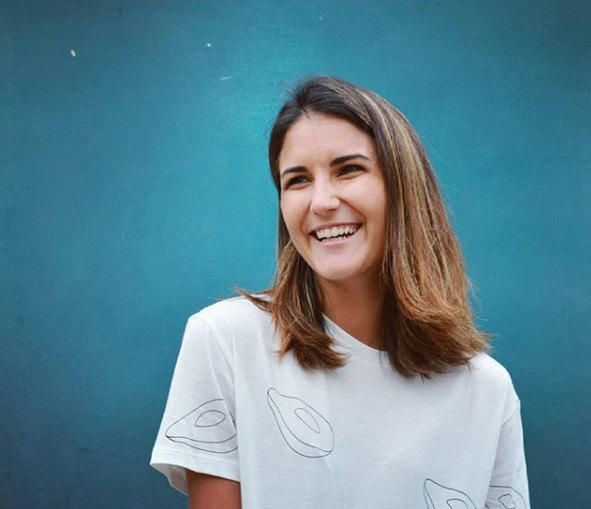
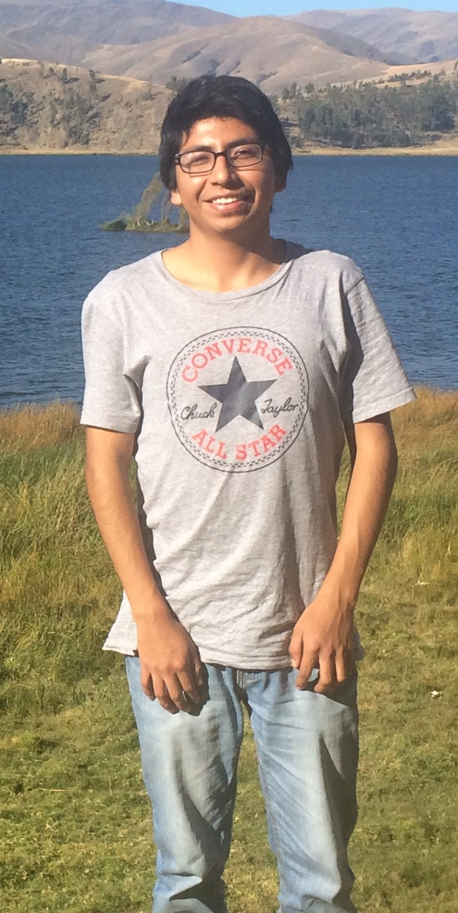
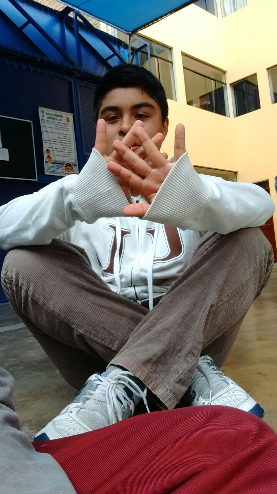
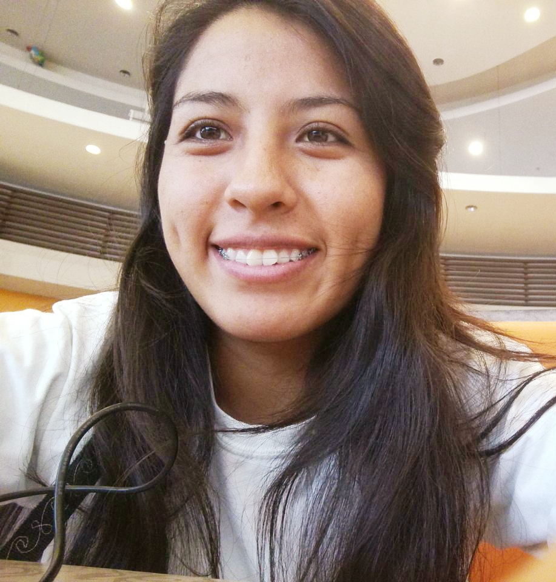

<section id="one">
	

		<header class="major">
			<h1>¿Quiénes somos?</h1>
		</header> 
    
<h2 id="content">Sobre el equipo</h2>

Somos estudiantes de la carrera de Ingeniería Biomédica, buscamos innovar en los principales ámbitos de la medicina mediante el uso de la ingeniería.

	

<dl>
	<dt>Joaquina Rubio</dt>
	<dd>
		
<b>Coordinadora General</b>
 
		

	

		

	

		

		
Me llamo Joaquina Rubio y tengo 22 años. Soy la coordinadora general de este proyecto y me ocupo de organizar y delegar las tareas del equipo para que todos participemos de manera equitativa y nuestras metas puedan cumplirse de forma efectiva y a tiempo. Soy estudiante de la carrera Ingeniería Biomédica y me motiva mucho este proyecto pues quiero poder aportar al progreso en la salud de mi país. 

	</dd>
	<dt>Johan Gora</dt>
	<dd>
		
<b>Encargado de Hardware</b>
 
		

	

		

	

		

		
Hola me llamo Johan Omar, tengo 20 años. Soy el encargado de Hardware y requerir los materiales necesarios para que el proyecto tenga viabilidad y que se pueda cumplir los estándares de calidad. Soy estudiante de la carrera de  Ingeniería Biomedica. Mi motivación para estudiar esta carrera es brindar mayores alternativas de diagnósticos, interpretación de imágenes.

	</dd>
</dl>

<dl>	
	<dt>Diego Palacios</dt>
	<dd>
		
<b>Encargado de Software</b>
 
		

	

		

	

		

		
Soy alumno de la carrera Ingeniería Biomédica, tengo 18 años y me encargo de la programacion y la página web

	</dd>
	<dt>Sandra Marchan</dt>
	<dd>
		
<b>Coordinadora Administrativa</b>
 
		

	

		

	

		

		
Soy estudiante de Ingenieria Biomedica mi interes se orienta en temas de biomecanica deportiva. Siempre me ha importado la salud de las demas personas y personalmente pienso que el sistema de salud en el Perû debe ser igualitaria e equitativa para todos.

	</dd>
</dl>
	

