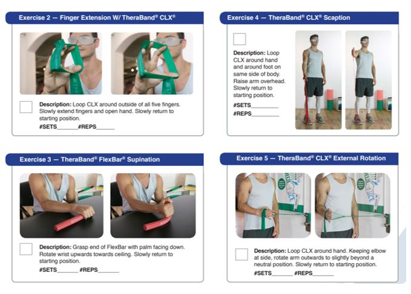
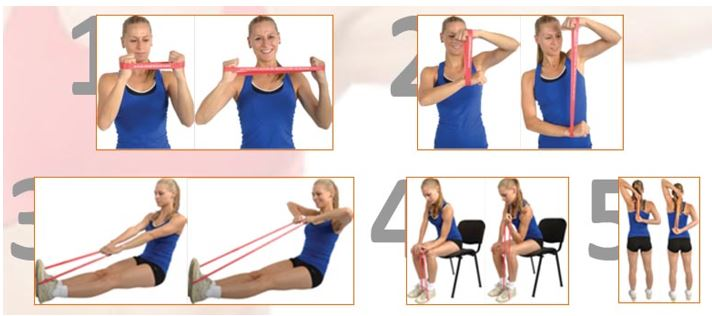

<!-- Main -->

<!-- One -->
<section id="one">
	

		<header class="major">
			<h2>Estado del Arte</h2>
		</header>
		
El estado del arte proviene originalmente del campo de la investigación técnica, científica e industrial y significa, en pocas palabras, la situación de una determinada tecnología. Lo más innovador o reciente con respecto a un arte específico. Esta noción ha pasado a los estudios de investigación académica como “el estado o situación de un tema en la actualidad”. Es una forma de aludir a lo que se sabe sobre un asunto, lo que se ha dicho hasta el momento que ha sido más relevante.

	

</section>

<!-- Two -->
<section id="two" class="spotlights">
	<section>
		
		

			

				<header class="major">
					<h3>Electric Infrared Heat Hand Massager Ball Massage Hand & Fingers Physiotherapy Rehabilitation Health Care Vibration Adjustable</h3>
				</header>
				
Es un dispositivo de terapia de masaje calentado tiene una carcasa manual, un generador de vibración mecánica dispuesto dentro de la carcasa, transmitiéndose la vibración mecánica a al menos una parte transparente conductora de calor, preferentemente infrarroja, y al menos una fuente de radiación infrarroja dispuesta dentro de la misma. la carcasa, la radiación infrarroja aplicada a al menos la parte conductora de calor de la carcasa. 

				
El producto: 
•	El masaje de vibración de alta frecuencia y compresión de calor infrarrojo, promueve la circulación sanguínea de los dedos de la mano. 
•	Elimine la fatiga de la mano causada por el trabajo prolongado. Diámetro de la bola de masaje: 8.5 cm 
•	Tipo de soporte Wirst, más cómodo de llevar Deja que los dedos del movimiento desordenados se muevan. 
•	Se utiliza para: accidente cerebrovascular, hemorragia cerebral, trombosis cerebral, parálisis cerebral, parálisis cerebral, lesión cerebral traumática, vértebra cervical, lesión espinal causada por otras causas anormales de la función de la mano, distonía de los dedos, espasmos de la mano, flexión de los dedos, atrofia muscular de la mano, etc. 
•	5 juegos para ajustar la fuerza del masaje. Tamaño libre, apto para la mayoría de las personas adultas. 2 piezas Se requieren baterias recargables (no incluidas). 

			

		

	</section>
	<section>
		
		

			

				<header class="major">
					<h3>El ejercicio FlexBar</h3>
				</header>
				
En el 2009 el Dr. Timothy Tyler del hospital Lenox Hill en Nueva York creó un método fácil y costo efectivo de terapia para la epicondilitis lateral con ejercicios excéntricos que liberan tensión en los músculos afectados y los estiran, aliviando el dolor y acortando el tiempo de recuperación. Se utiliza una barra llamada flexbar que permite hacer estos ejercicios, en los cuales la mano del brazo no comprometido intenta girar la barra flexionando la muñeca mientras la muñeca del brazo comprometido se mantiene extendida, intentando detener el movimiento. Se deben hacer 3 series de 15 repeticiones todos los días por aproximadamente 6 semanas. Estudios de este método lo comprobaron sumamente eficaz para aliviar el dolor y devolver fuerza a los músculos.[3] 

			

		

	</section>
	<section>
		
		

			

				<header class="major">
					<h3>BANDA CLX</h3>
				</header>
				
 De acuerdo con múltiples estudios, la resistencia elástica utilizada en TheraBand CLX Consecutive Loops es equivalente al entrenamiento con pesas en la curva de fuerza, activación muscular, esfuerzo percibido y ganancia de fuerza. 
•	Ofrece múltiples opciones únicas de agarre, permite ejercitarse como agarres manuales abiertos y cerrados, sujetar objetos con resistencia, ejercicio sin necesidad de agarre 
•	Habilita nunca antes posible el ejercicio como el trabajo simultáneo de la parte superior e inferior del cuerpo, abriendo posibilidades increíbles para la serie de atletas. 
•	El sistema de resistencia progresiva codificado por colores permite a los usuarios reconocer las mejoras a medida que pasan, a medida que creces, puedes pasar al siguiente color. 
•	Las bandas de resistencia al látex de caucho natural de la más alta calidad son reconocidas como el sistema original de resistencia progresiva por más de 40 años. 
•	Cada banda mide 5 pies de largo X 4 pulgadas de ancho y viene en tres niveles de resistencia codificados por color: Amarillo-3-4.3 lbs .; Rojo-3.7-5.5 lbs .; Verde-4.6-6.7 lbs.  
				PRECIO PROMEDIO: $ 14.99 - $ 24.99 / 66 soles

			

		

	</section>
	<section>
		
		

			

				<header class="major">
					<h3>Implementación de robots animatrónicos para terapias motivadoras de rehabilitación física en niños</h3>
				</header>
				
Los diseños de los animatrónicos fueron desarrollados en un software CAD. Presenta una interfaz que permite al fisioterapeuta, programar el avance del juego de acuerdo a las capacidades y los requerimientos físicos del usuario. A través de esta interfaz, se configura el  puerto COM que establece la comunicación con la tarjeta Arduino y el computador. Incorporan un ambiente lúdico pueden apoyar la fisioterapia en miembros superiores e inferiores. 

			

		

	</section
	
	
</section>
<!-- Three -->
<section id="three">
	

		<header class="major">
			<h2>Ejercicios con estos productos</h2>
		</header>
		<h3>Ejercicios con ayuda del Flexbar</h3>
		
		<h3>Ejercicios con ayuda del CLX</h3>
		
		<ul class="actions">
			<li><a href="generic.html" class="button next">Inicio</a></li>
		</ul>
	

	
</section>

