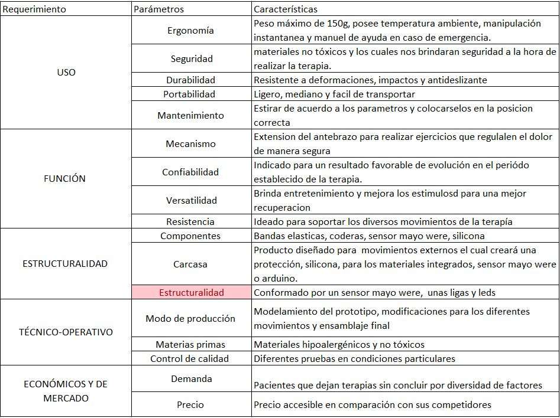
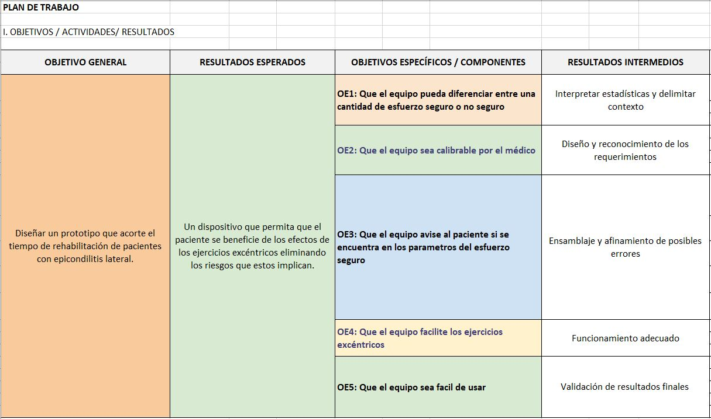

<h1>REQUERIMIENTOS DE DISEÑO</h1> 
  
 

<h1>PLAN DE TRABAJO</h1> 
  
 
<h1>CRONOGRAMA</h1> 
 
 

<h2>Referencias</h2>

-Gerardo Rodríguez.Manual de Diseño Industrial.Mexico.Recuperado de
http://www.cua.uam.mx/pdfs/conoce/libroselec/16ManualDI.pdf

