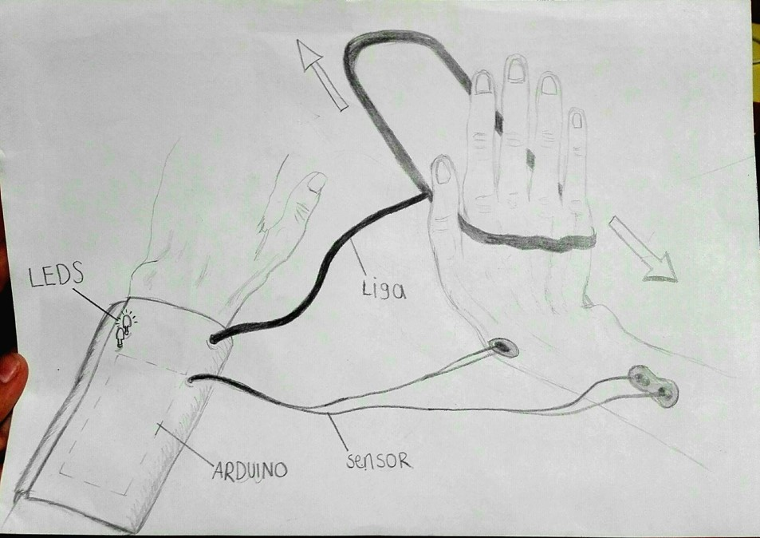
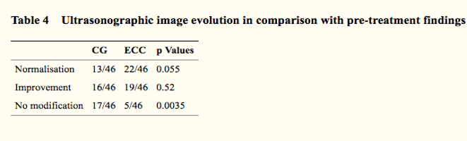
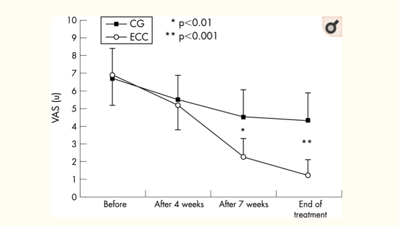
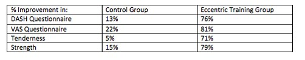
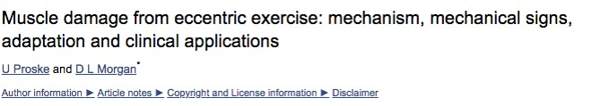
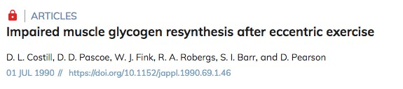

  
<h1>Solución</h1> 

Integramos procesos de fuerza y monitoreo que serán usados durante la rehabilitación de una manera sencilla, cómoda y más eficiente. El equipo presenta una liga cuya función será ejercer una determinada fuerza por la mano que está sana al brazo con epicondilitis mediante un monitoreo con unos leds integrados al brazalete según el rango de intensidad de fuerza que será expuesto por los ejercicios excéntricos. Con el uso de un sensor de músculo buscamos que el especialista pueda dar un rango y programarlo mediante una interfaz para que el paciente pueda realizar eficazmente la rehabilitación en su hogar,  realizando los ejercicios óptimamente y evitando que ejerza distinta fuerza y pueda dañar otros músculos.
  

   

<h2>Ejercicios Excéntricos</h2>

<h4>(Croisier, J. et al., 2007)</h4>
    

<h4>(Croisier, J. et al., 2007)</h4>
    

<h4>(Tyler, T. & McHugh, M.,2010)</h4>    

<h2>Riesgos</h2>
 

<h4>(Newham, D.J. et al., 1987)</h4>
    

<h4>(Proske, U. and Morgan, D., 2001)</h4>
    

<h4>(Costill, D.L. et al., 1990)</h4>

<h2>Referencias</h2>

Cortés-Monroy,C., Soza, S. (2014). Usos prácticos de la toxina botulínica en adultos en medicina física y rehabilitación. Revista Médica Clínica Las Condes, 25(2), 225-236. 
Costill, D.L., Pascoe, D.D., Fink, W.J., Robergs, R.A., Barr, S.I, y Pearson, D. (1990). Impaired muscle glycogen resynthesis after eccentric exercise. Pub med, 69(1), 46-50. 
Croisier, J.L et al. (2007). An isokinetic eccentric programme for the management of chronic lateral epicondylar tendinopathy. NCBI-PCM, 41(4), 269–275.  doi:  10.1136/bjsm.2006.033324 
Haake. M. (2002). Side-effects of extracorporeal shock wave therapy (ESWT) in the treatment of tennis elbow. Springer Link, 122(4), 222–228 
Newham, D.J., Jones, D.A., y Clarkson, P.M. (1987). Repeated high-force eccentric exercise: effects on muscle pain and damage. Pubmed, 63(4), 1381-6. 
Sayegh, E.T., Strauch, R. J. (2014). MD Does Nonsurgical Treatment Improve Longitudinal Outcomes of Lateral Epicondylitis Over No Treatment? A Meta-analysis. NCHI, 473(3), 1093–1107. 
Sociedad Española de Reumatología. (2014). Manual SER de Enfermedades Reumáticas. Barcelona, España: Elsevier España. 
Tyler, T.F., Thomas, G.C., Nicholas, S.J., y McHugh, M.P. (2010). Addition of isolated wrist extensor eccentric exercise to standard treatment for chronic lateral epicondylosis: a prospective randomized trial. Pub Med, 19(6), 917-22.  doi: 10.1016/j.jse.2010.04.041 
Proske, U. and Morgan, D., (2001). Muscle damage from eccentric exercise: mechanism, mechanical signs, adaptation and clinical applications. Pubmed, 537 (2),333-345. 
Vicenzino, B. (2006). Mobilisation with movement and exercise, corticosteroid injection, or wait and see for tennis elbow: randomised trial. Thebjm, 333,939. doi: https://doi.org/10.1136/bmj.38961.584653.AE 

