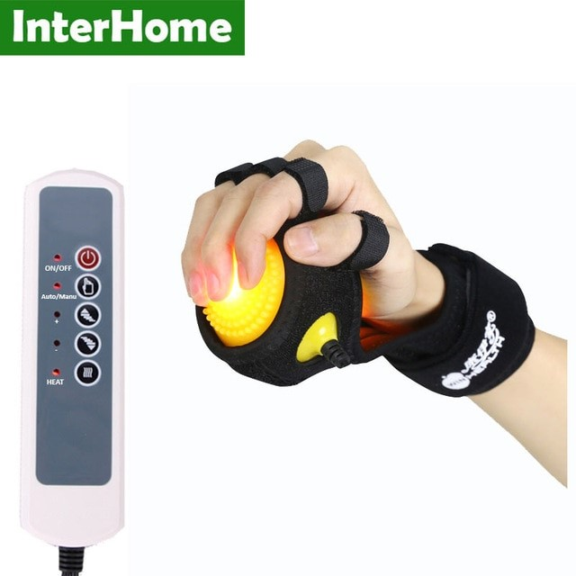
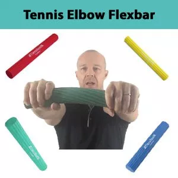
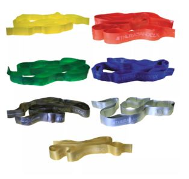
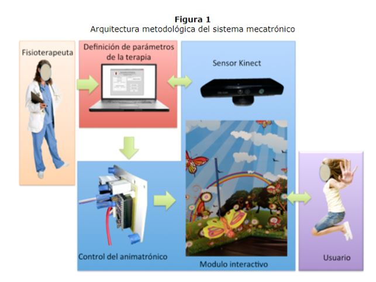

<!-- Main -->

<!-- One -->
<section id="one">
	

		<header class="major">
			<h2>Estado del Arte</h2>
		</header>
		
El estado del arte proviene originalmente del campo de la investigación técnica, científica e industrial y significa, en pocas palabras, la situación de una determinada tecnología. Lo más innovador o reciente con respecto a un arte específico. Esta noción ha pasado a los estudios de investigación académica como “el estado o situación de un tema en la actualidad”. Es una forma de aludir a lo que se sabe sobre un asunto, lo que se ha dicho hasta el momento que ha sido más relevante.

	

</section>

<!-- Two -->
<section id="two" class="spotlights">
	<section>
		
		

			

				<header class="major">
					<h3>Tenease</h3>
				</header>
				
Tenease es un dispositivo que utiliza terapia de ondas de choque extracorpórea, un tratamiento aprobado por NICE (el Instituto Nacional de Salud del Reino Unido), para aliviar el dolor y acelerar el tiempo de recuperación en pacientes con epicondilitis lateral[1].  Funciona generando vibraciones de alta frecuencia localmente para pasar ondas de choque al tendón, interfiriendo con las transmisión de señales de dolor y estimulando el flujo sanguíneo en la zona afectada. Es manufacturado por Medical Technology Ltd en el Reino Unido, y fue lanzado al mercado en el 2010. Su uso recomendado es de 3 tratamientos de 10 minutos cada día por hasta 6 semanas[2].  Ha sido aprobado por el FDA y el MHRA. Se vende a aproximadamente $72.

				<ul class="actions">
					<li><a href="generic.html" class="button">Bibliografía</a></li>
				</ul>
			

		

	</section>
	<section>
		
		

			

				<header class="major">
					<h3>El ejercicio FlexBar</h3>
				</header>
				
En el 2009 el Dr. Timothy Tyler del hospital Lenox Hill en Nueva York creó un método fácil y costo efectivo de terapia para la epicondilitis lateral con ejercicios excéntricos que liberan tensión en los músculos afectados y los estiran, aliviando el dolor y acortando el tiempo de recuperación. Se utiliza una barra llamada flexbar que permite hacer estos ejercicios, en los cuales la mano del brazo no comprometido intenta girar la barra flexionando la muñeca mientras la muñeca del brazo comprometido se mantiene extendida, intentando detener el movimiento. Se deben hacer 3 series de 15 repeticiones todos los días por aproximadamente 6 semanas. Estudios de este método lo comprobaron sumamente eficaz para aliviar el dolor y devolver fuerza a los músculos.[3] 

				<ul class="actions">
					<li><a href="generic.html" class="button">Bibliografía</a></li>
				</ul>
			

		

	</section>
	<section>
		
		

			

				<header class="major">
					<h3>TENS[4]</h3>
				</header>
				
Es un aparato de electro-estimulación percutánea, aplica una cantidad necesaria de corriente eléctrica, para controlar los dolores crónicos o agudos. Está técnica tiene la ventaja de que no es invasiva y las probabilidades de contraer efectos colaterales es mínima. Generaremos una interferencia entre el dolor y la sensación de dolor,  teoría de Melzack y Wall, para poder disminuir o controlar el dolor existente. Además, esta técnica no se debe aplicar en zonas cutáneas irritadas y en personas con problemas cardiacos, poseen un marcapaso.
TENS tiene que ser aplicado a una frecuencia necesaria y controlada con tiempos exactos, la curación, alivio, dependerá de la precisión y conservación de las normas de uso.
Generalmente es uno de los primeros tratamientos para la epicondilitis lateral. 
Costo por sesión $10 y costo por un equipo, menor frecuencia, $169

				<ul class="actions">
					<li><a href="generic.html" class="button">Bibliografía</a></li>
				</ul>
			

		

	</section>
	<section>
		
		

			

				<header class="major">
					<h3>Tecarterapia[5]</h3>
				</header>
				
Es una terapia física la cual usa radiofrecuencia, generalmente a 448Khz. Técnica no invasiva, recuperación más rápida que la convencional. Genera corrientes de cargas eléctricas presentes en el interior del tejido en forma de iones. La corriente no se transmite por contacto directo sino por el movimiento de atracción y repulsión de las cargas eléctricas: el cuerpo se recupera naturalmente. Además genera vasodilatación el cual genera reducción del dolor y disminuye la tensión muscular. Funciona en dos versiones: capacitivos y resistivos, la diferencia son en los electrodos; el capacitivo se concentra en los músculos y tejidos blandos; el resistivo se concentra en el sistema musculoesquelético (huesos, tendones y ligamentos). 

				<ul class="actions">
					<li><a href="generic.html" class="button">Bibliografía</a></li>
				</ul>
			

		

	</section>
	<section>
		
		

			

				<header class="major">
					<h3>DolorClast</h3>
				</header>
				
DolorClast 
La terapia de ondas de choque extracorpóreas (ESWT) es la aplicación de las ondas de choque en la medicina.
El tratamiento de ondas de choque que consiste en la emisión de ondas de choque de baja intensidad (0.8 – 0.16 mJ/mm2) es notablemente uno de los tratamientos, no invasivos, más efectivos. En la mayoría de los estudios para validar esta afirmación, se separa en 2 grupos a pacientes con codo de tenista, y se les aplica un tratamiento con ondas de choque con diferente frecuencia e intensidad a cada grupo. Ninguno de los grupos difería entre si antes del estudio, ambos presentaban resultados regular o malo en la escala analógica visual del dolor (VAS). Las primeras observaciones son que ambos grupos se mantuvieron a la par a lo largo de los meses, las variaciones eran mínimas, ambos progresaban a la par. Y segundo que después de un seguimiento de 6-12 meses aproximadamente, el dolor medido en una escala analógica visual (VAS) disminuyó significativamente en ambos grupos. Ambos grupos presentaron un resultado excelente o bueno en un 58% de los casos, que en comparación al inicio del estudio es una mejora increíble.[6][7][8][9] 					
Se ha demostrado clínicamente que las ondas de presión, aplicadas a los tejidos lesionados, estimulan las reacciones metabólicas:
	Reducen del dolor sentido por las fibras nerviosas 
	Incrementan la circulación sanguínea en los tejidos blandos circundantes 
	Inician un proceso de curación desencadenado por la activación de las células madre.[10] 

				<ul class="actions">
					<li><a href="generic.html" class="button">Inicio</a></li>
				</ul>
			

		

	</section>
	<section>
		
		

			

				<header class="major">
					<h3>Magnoterapia Pulsátil</h3>
				</header>
				
La magnetoterapia pulsátil reduce el dolor causado por codo del tenista. Los fenómenos electromagnéticos tienen tres aspectos de aplicación médicobiológica.
•	comprensión de los procesos eléctricos que se operan en el organismo, 
•	conocimiento de las propiedades eléctricas y magnéticas de los medios biológicos. 
•	mecanismo de acción de los campos magnéticos sobre el organismo.
Esta acción puede intervenir como factor curativo y es de interés fundamental si se pretende utilizar el campo magnético como terapéutica. Se utiliza con onda media las 3 primeras aplicaciones y completa en las siguientes, hasta llegar a 10, aproximadamente. El resultado es excelente a partir de la tercera o cuarta aplicación. No es necesario bloquear a ningún paciente. Esta enfermedad puede considerarse como una de las más beneficiadas con el empleo de la magnetoterapia.
Por una parte, las corrientes inducidas por el campo magnético producen un estímulo directo del trofismo celular, que se manifiesta por el estímulo en la síntesis de la energía que requiere el organismo para su función a nivel celular favoreciendo de esta manera la multiplicación celular, la síntesis proteica y la producción de prostaglandinas (efecto antinflamatorio). Por otra parte, hay un estímulo del flujo iónico a través de la membrana celular, en especial de los iones Ca++, Na + y K +. Esta acción tiene gran importancia cuando el potencial de membrana está alterado. Las cifras normales del potencial de membrana se sitúan entre 60 y 90 mV .Este potencial se mantiene mediante un mecanismo activo, en el que es fundamental la expulsión al exterior de la célula del ión Na +, que penetra en ella espontáneamente (bomba de sodio). 
Desde el punto de vista tisular y orgánico, la magnetoterapia presenta una serie de acciones, de las cuales las más importantes son: 
•	desintoxicación y aceleración del metabolismo
•	vasodilatación (incremento del riego sanguíneo)
•	miorelajación (liberación de espasmos)
•	curativo y regenerativo, antiinflamatorio y antireumático
•	contra el dolor (analgésico)
•	antiedemático (con acción anti-hinchazón)[11]
 

				<ul class="actions">
					<li><a href="generic.html" class="button">Bibliografía</a></li>
				</ul>
			

		

	</section>
	
</section>
<!-- Three -->
<section id="three">
	

		<header class="major">
			<h2>Massa libero</h2>
		</header>
		
Nullam et orci eu lorem consequat tincidunt vivamus et sagittis libero. Mauris aliquet magna magna sed nunc rhoncus pharetra. Pellentesque condimentum sem. In efficitur ligula tate urna. Maecenas laoreet massa vel lacinia pellentesque lorem ipsum dolor. Nullam et orci eu lorem consequat tincidunt. Vivamus et sagittis libero. Mauris aliquet magna magna sed nunc rhoncus amet pharetra et feugiat tempus.

		<ul class="actions">
			<li><a href="generic.html" class="button next">Get Started</a></li>
		</ul>
	

</section>

